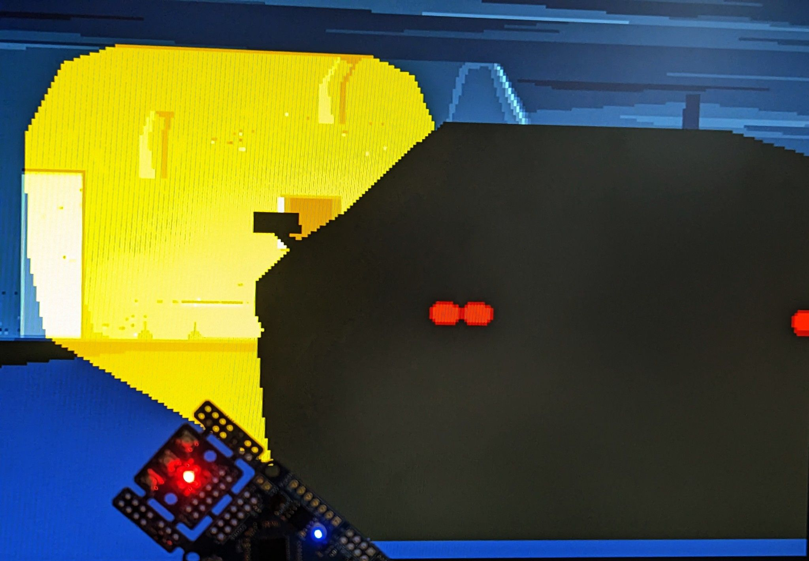
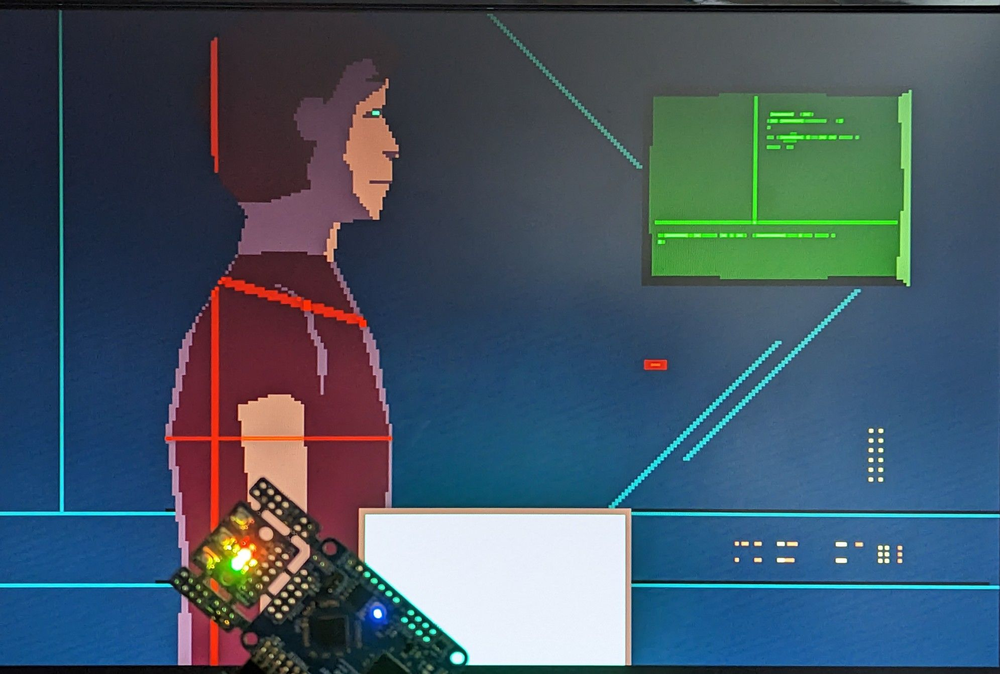
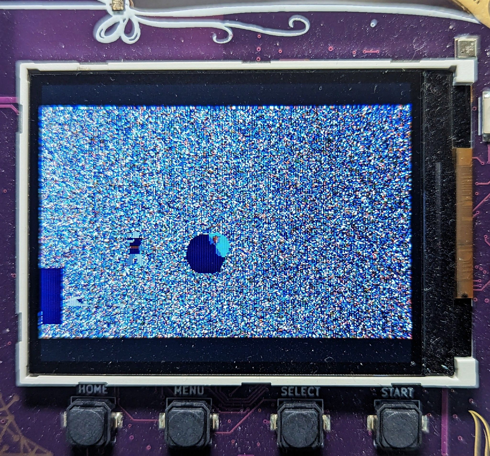
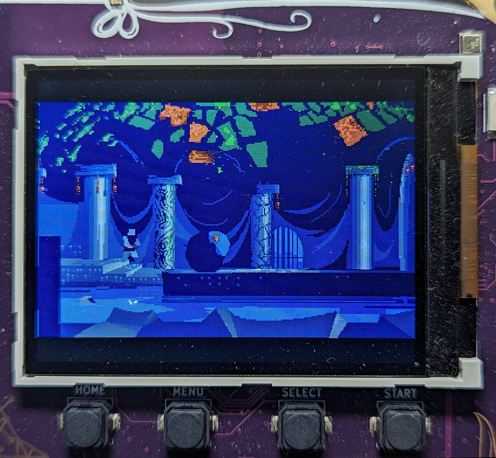

# a5k: How I remade Another World / Out of This World in hardware on the UP5K FPGA

> Just want to test?
>
> **Simulation:** Checkout the repo, install [Silice](https://github.com/sylefeb/Silice/GetStarted.md)
> put the [game data](#wheres-all-the-data) in `GAMEDATA`
> and from a command line type in `make simul1` (no need for an actual FPGA,
> this will run the intro in simulation).
>
> **Hardware:** Current supported boards are the icebreaker + VGA PMOD, mch2022 badge and ULX3S over HDMI. Pre-built bitstreams are included but the [game data](#wheres-all-the-data) is needed in `GAMEDATA` so the data packs can be prepared. [Jump here](#wheres-all-the-data) if you'd like to test on hardware first.

<p align="center">&nbsp;&nbsp;</p>

## Foreword

This project is my personal homage to Another World.
This game is not only a graphical and gameplay masterpiece, it is also a technical
marvel: The entire game runs on a beautifully designed Virtual Machine (VM) that
calls only a blitter and rasterizer to produce the graphics in four framebuffers!
([what's a vm, blitter or rasterizer anyway?](#lexic))

The VM is quite minimalistic, and both the blitter and [rasterizer](https://twitter.com/sylefeb/status/1361072515641188356) are good
candidates for hardware designs. Therefore it was very tempting to create
a hardware implementation of the entire framework : no standard CPU, a truly
native hardware version of the Another World VM, blitter and rasterizer. While
I'll keep referring to the "VM" in the following, keep it mind it will become an
actual custom processor, implementing on an FPGA all of Another World opcodes in
hardware. This is not a 6502, not a Z80, not a 68000: this is **an Out-Of-This-World-chip!**

As I started to explore hardware remakes of various game render loops (e.g. [Wolfenstein3D](https://twitter.com/sylefeb/status/1254711510812602368), [Comanche](https://github.com/sylefeb/Silice/tree/master/projects/terrain/README.md), [Doom](https://twitter.com/sylefeb/status/1258808333265514497), [Quake](https://twitter.com/sylefeb/status/1564758778830065666)),
the idea of doing a hardware version of Another World was very tempting.
What really made it click is when I realized, reading [@fabynou excellent blog](https://fabiensanglard.net/another_world_polygons/),
that the four framebuffers were 4-bits 320x200. That meant 128KB of data in total
which precisely fits the Lattice UP5K SPRAM! This was too good to pass on!

> SPRAM is a special fast memory embedded within the FPGA, more on this later.

The entire design revolves around four major components:
- The VM that becomes an actual processor implemented in hardware,
- The (hardware) blitter that copies data between framebuffers,
- The (hardware) rasterizer that draws polygons in framebuffers,
- The SOC that glues everything together, adding the display refresh.

The UP5K Lattice FPGA runs comfortably at 25 MHz. This makes it easy to meet
game performance requirements (recall the original was running on 7-8 MHz machines).
The challenge is more in terms of fitting memory and FPGA resource requirements.
Indeed, an FPGA is a grid of [programmable logic cells with programmable
interconnect](https://github.com/sylefeb/Silice/blob/master/learn-silice/README.md#fpga-hardware-design-101).
There is a fixed number of cells, and even though a design could theoretically
work in simulation it might not fit a given FPGA. The 'logic' - think of it as
the code - has to fit within a budget. This budget is often expressed in number
of 'LUT's which are the small programmable units of the FPGA fabric (LUT stands
for Lookup Up Table, this is a [simple yet powerful concept](https://github.com/sylefeb/Silixel) behind FPGAs).

To give you an idea, 1K LUTs let's you do a fairly capable [dual core RISC-V 32 bits CPU]([https://](https://github.com/sylefeb/Silice/blob/master/projects/ice-v/IceVDual.md)) and 5K LUTs (plus some DSPs) a [SOC that can run Doom](https://www.youtube.com/watch?v=3ZBAZ5QoCAk) and a [CPU+GPU capable of perspective correct 3D rendering](https://github.com/sylefeb/tinygpus/) (Comanche, Doom, Quake). Thus it seemed 5K LUTs ought to be enough for Another World.

> Overall it really feels the design wanted to fit 5K LUTs, this is more or less where it ended without too much optimization effort. But it could, for sure, be a lot smaller.

However the framebuffers really are the 'hot piece'. They need to be accessed
quickly for both display (screen refresh) and rendering (raster/blitter).
It just happens that the UP5K features 128KB of SPRAM memory, a memory that can
be accessed (read or write) in 1 cycle. And it features a write mask to write the
memory by groups of 4-bits (nibbles), exactly matching a 4bpp palette.
This makes it a perfect candidate.

So, let's get started!

> If you'd rather skip the details and just want to run the design,
> [jump here](#wheres-all-the-data).

## The making of

> While I do not assume any prior knowledge in the following, let me recommend
> Fabien Sanglard excellent [blog series on Another World](https://fabiensanglard.net/another_world_polygons/index.html) before we get started. His posts give an in-depth overview of the
> engine. A lot here is based on [Fabien's fork](https://github.com/fabiensanglard/Another-World-Bytecode-Interpreter) of the C++ port by Gregory Montoir.

### Getting started

So how did I get started on this all? At first, the task of doing a remake can be intimidating. But as always I started from the data. Before
anything you have to understand the data, how it is loaded, how large it is, how it flows through the code at runtime and how you can load it into your own version. This was *greatly* facilitated by
the [C++ port](https://github.com/fabiensanglard/Another-World-Bytecode-Interpreter).

My first task was to check whether there were any dynamic loading of data during the game execution. A favorable scenario is to have a single data pack comfortably stored in ROM -- in our case the SPI-memory (see note below) -- and avoid any sort of runtime dynamic allocation. Because we won't have *malloc* or any sort of such luxury here :-D.
By the way, *data* here means both the instructions for the VM, the graphics and sound. The graphics are (*almost*) entirely polygons, stored in a specific way that makes the rasterizer simpler. More on this later.

> We are targeting FPGAs, and most boards typically feature a *SPI-flash* memory.
> This is a relatively large memory (e.g. 16 MB) that is slow to write to but quite
> fast to read from (think 10-20 cycles for random access). So from the design point of view it acts as a ROM. It also
> retains its content when powered off.

To track the data I started to dive into the C++ port. The VM is easily identified as `vm.cpp`, which essentially contains one method per operand plus the global orchestration of game threads (only one is active at a time, there is no true parallelism within the VM).
From the code, we can see that there are 256 VM variables (`VirtualMachine::vmVariables`) as well as 64 records for threads
(each record is 64 bits : two 16 bits data fields in `threadsData`, one 16 bits call stack pointer in `_scriptStackCalls` and two 8 bits active fields in `vmIsChannelActive`).
This is already great news, as this means the entire VM state could fit into BRAMs -- another special type of memory distributed across the FPGA fabric that answers to read/write requests in just one cycle. So think of these variables and thread records as VM internal registers: it means the hardware 'VM' has 256 registers and 64 threads.

> BRAM, contrary to SPRAM, can be initialized at power up. There are also variants allowing multiple read/write ports, we'll come back to this later. There is however not a lot of BRAM on FPGAs, the UP5K provides 120 Kbits.

Back to tracking game data. One operand stands out as being for data manipulation: `VirtualMachine::op_updateMemList`. Looking at the code, a `resourceId` is given as operand and loaded by `Resource::loadPartsOrMemoryEntry` (from `resource.cpp`).
So this is where I started, adding "printf's" (the C++ port as a nice logging system that I used) and working my way down the chain. Beyond `Resource::loadPartsOrMemoryEntry` this led me to  `Resource::loadMarkedAsNeeded` where actual loading occurs from the game resource management system -- exactly the type of runtime system I'd like to bypass :)

Looking at the logs confirmed that after an initial loading stage, the op code was no longer called until the end of a long section of the game. In addition, we can see in `Engine::init` (from `engine.cpp`) that single game sections -- or *parts* -- can be launched independently calling `VirtualMachine::initForPart`. For instance, the famous intro section is the second part (the first is the protection screen). Selecting various parts confirmed that loading indeed occurs only at the beginning of each of these sections.

This gave me hope that each game part could be stored into a single, separate game package loaded once at the start of the part.
To try this I instrumented the calls to `op_updateMemList` such that a data pack would be dumped after each call, the idea being that the full pack for the part is dumped on the last call. The start address is `Resource::_memPtrStart`, after which loaded data is copied by calls to `Resource::loadMarkedAsNeeded`. The end address is `Resource::_scriptCurPtr` which advances each time a resource is loaded from `Resource::loadMarkedAsNeeded`.

After obtaining a first data pack, I commented out the content of `op_updateMemList` and loaded the pack once at the start of the game part, in `Resource::setupPart`. It worked!

> To create the data packs the `Makefile` compiles and runs my fork of the C++ port, which outputs the data package of a part.

> A data pack contains different sections of data, and their start offset is different for each game part. For now, these offsets are baked into the hardware design, which means we have one design for each game part. Not ideal. I did experiment with loading the offsets from the ROM (code is commented) but this incurs a relatively significant increase in LUTs. Quite sure this can be improved!

## Time for a 'hardware VM'

Once the data pack obtained, I created a first minimalist SOC with SPI-memory and a skeleton of the VM. The overall execution pattern of the VM is to fetch the next instruction operator (a byte)  from memory at the program counter `pc` address, select what to do, load the necessary operands from memory and act upon it. The number and size of operands varies between operators. Many operators only modify the VM state (registers, threads and `pc`) while others have side effects such as drawing polygons or using the blitter to transfer data between framebuffers.

SPI-memory is such that there is a latency to start reading from an address, but once started the data is streamed in every cycle ([Quad SPI at 2x the clock](https://github.com/sylefeb/Silice/blob/wip/projects/spiflash/README.md)). So to avoid a slow byte per byte reading and to amortize latency, I start by fetching some sufficient number of bytes (64) into a small BRAM cache, getting both the operator and all operands that might be required.

The overall process of fetching instructions is enclosed into an outer loop that deals with threads. For this I simply reproduced the logic from `vm.cpp`, adjusting for the use of BRAMs instead of arrays.

I first implemented all basic operands manipulating registers, leaving out operands regarding polygons, rasterizer and blitter. The key idea here is that the VM execution is not influenced by what happens in the blitter and rasterizer: these are outputs only from the VM. Thus, having these initial operands is enough to run the VM in simulation and compare its trace to the C++ version. I instrumented both, using `__display` in Silice to output a trace from simulation. Silice has a verilator framework and [SPI-memory controllers](https://github.com/sylefeb/Silice/blob/wip/projects/common/qpsram2x.si) that allow for simulation, reading data from a `data.raw` binary file in the current directory, so I could use the actual data packs in simulation.

From there on I spent *some* time looking a traces, comparing any divergence between simulated and reference C++ versions. Here's an excerpt of a trace (the number between `[` `]` is the cycle counter):

```
hostFrame() i=0x03 n=0x22d1
[   3722016] op_jmp 22cc
[   3722096] op_Polygon (vid_opcd_0x80) @0cb8
[   3730573] op_pauseThread
[thread   3] done
hostFrame() i=0x3c n=0x0091
[   3730824] op_jmp 007f
[   3730904] op_addConst [199]+=     1 (before:     33)
[   3730982] op_blitFramebuffer ff (swap:0)
[   3731691] op_selectVideoPage ff
op_condJmp b[250]:     0 a:     0 expr:0 [   3731773]
[   3731854] op_copyVideoPage 40 => ff
[   3731932] op_pauseThread
[thread  60] done
hostFrame() i=0x02 n=0x248a
```

Getting to this point was relatively easy, and soon I had a fully functional VM in terms of going through instructions. Only problem, it was not drawing anything!

> The full VM hardware design is in [vm.si](hardware/vm.si).

## The framebuffers

Time to prepare for some graphics! The first step was to set up the four framebuffers.

The framebuffers are using the four SPRAM blocks of the UP5K. A SPRAM is similar to a BRAM but larger. Contrary to a BRAM, a SPRAM cannot be initialized with a specific content, but that is not something we need for framebuffers. Note that while BRAMs are very common in FPGAs, SPRAM blocks are rarely found so this is a nice feature of the UP5K.

Each SPRAM block is 32KB, with a 16 bits data interface and a write mask allowing to write nibbles (4 bits) independently. This is perfect for us as Another World uses a 16 colors palette (4 bits per pixel) in 320x200 resolution buffers. This makes each framebuffer 32KB, so one framebuffer maps perfectly onto a SPRAM block.

The [`videopage` unit](hardware/a5k.si#L169) in `a5k.si` implements a framebuffer in a SPRAM block, and four `videopage` units are instanced ([`page0` to `page3`](hardware/a5k.si#L626)) in the SOC `main` unit, one per framebuffer.

The `videopage` unit exposes a 4 bits interface with per-pixel addressing, and translates these addresses into 16 bits wide access in SPRAM with a write mask and adequate shifts.

> This is slightly inefficient as accessing four neighboring pixels requires four accesses, while the 16 bits interface would allow to read/write all four at once. I chose to not optimize this as there is no strong pressure on performance. However, other designs like the [hardware terrain project](https://github.com/sylefeb/Silice/tree/master/projects/terrain#the-framebuffer) exploit this fully.

> On the ULX3S the videpage unit is implemented with BRAM, a big luxury only possible on the much larger ECP5 FPGA.

## The display

Let us first discuss the display controller. As we'd like to
target VGA, HDMI or SPI-screens we'll settle on a common interface.
We are going to assume that the display controller has the following requirements:
- A frame is sent by streaming pixels at 25 MHz (the SOC frequency, and as it just happens this matches the pixel clock of 640x480 for VGA/HDMI).
- Between two frames a blanking interval exists, as indicated by a `vblank` signal (high in between frames).

The display controller thus has to be consistently fed with pixels outside
of the blank interval, *and this process cannot be paused within a frame*. Two framebuffers are special: `page1` and `page2`. They are the one being sent to the display. Why two? Overall one is being sent while the game draws in the other, and the buffers are swapped when ready. This prevents visible blinking while new shapes are drawn, an approach known as *double buffering*.

However, the game sometimes reads from the buffer being displayed. The `videopage` (and underlying SPRAM) cannot support this: at a given cycle a single read or write is possible. To deal with this situation we have to restrict access to the displayed page, allowing other reads to occur only during the blanking interval, when the screen is not being refreshed. This is detected by setting the variable
[`display_conflict`](hardware/a5k.si#L709) that is used to disable the blitter and rasterizer
when they should not access a videopage.

The display section accessing the pages can be seen in [a5k.si](hardware/a5k.si#L771) (for VGA/HDMI).

> Some special BRAMs, called *dual-port*, support two accesses within the same cycle. Our SPRAMs are hower *single port* and perform a single access within a cycle. This is actually the meaning of SP- in SPRAM!

---

## The blitter

Now that we have framebuffers and a display, it is time to look into [the blitter](hardware/a5k.si#L122). The role of the blitter is simple: it copies the content of one framebuffer to another, or fills a framebuffer with a solid color.

The VM has several outputs and one input regarding the blitter, all prefixed `blitter_`. The VM starts the blitter by pulsing `blitter_start` high, after setting `blitter_src` and `blitter_dst` to the index of one of the four framebuffers. The blitter may be already busy, so before starting it the VM waits on `blitter_busy`.

> In simulation the blitter checks that there are no start pulses while busy, and uses `__display` and `__finish` to stop. A runtime assert!

The VM indicates a color fill by setting `blitter_src[2,1]` (bit two) in which case the blitter uses `blitter_color` instead of a source buffer.

The [`blitter` unit](hardware/a5k.si#L122) in `a5k.si` implements (surprise!) the blitter. The logic is simple: a `count` goes from 0 to 63999, visiting all pixel addresses for a 320x200 framebuffer. The count is triggered by the `start` pulse and increases every cycle while `enabled` is high. The count value is output in `src_addr` as well as in `dst_addr` but with a one cycle latency (`prev_count`). These addresses are used in `main` to access the pixels in the pages selected by `blitter_src` and `blitter_dst`.
The one cycle latency is necessary as it takes one cycle to get the data from `src_addr` into `src_data` (through the videopage SPRAM).
So the data written at `dst_addr` is the one that was accessed at `src_data`
at the previous cycle.

> The access logic is outside as it is shared with the rasterizer and display controller, so `main` acts as an arbiter.
> Understanding the 4 framebuffers and their interations with the blitter and rasterizer was
a difficult part of the project, but I'll skip these details for now.

The blitter reports `busy` high as long as `prev_count` does not reach the last pixel. When it does, `busy` goes low. Note [how `busy` also controls](hardware/a5k.si#L161) `dst_wenable`;
when `busy` is low no writes can occur, so even though `count` keeps going nothing changes in the destination videopage anymore.

> It might seem cleaner to stop `count` from increasing when done. But this adds
> extract logic -- and hence uses more LUTs -- without any gain. A typicaly case
> of hardware design where trying to *not* do something is more expensive than
> always doing it.

I mentioned earlier that `count` is only increasing when `enabled` is high.
Looking into `main` we see that `enabled` is bound to `vblank` ([see the line](hardware/a5k.si#L633)
`blitter blit( enabled  <: video.vblank );` ). This
ensures that the blitter only copies during `vblank`, such that the screen
controller has access priority. The blitter pauses during display.

## The rasterizer

> Almost done! *(famous last words - @sylefeb)*

Now onto the rasterizer. There are two parts to this. First, how to get
polygons from the data package, which is something to do in the VM.
Second, the rasterizer itself. I'll focus on the first part and simply explain a nice aspect of the Another World rasterizer that I realized working on the
engine. Detailing the rasterizer would go beyond the scope of this write up,
but please see my [tinygpus](https://github.com/sylefeb/tinygpus/) and
[flame](https://github.com/sylefeb/projects/fire-v/doc/flame.md) writeups for
more details on rasterization.

Again the crux of the matter is the data, in this case the polygons
data. The rasterizer will need to read polygon vertices from *somewhere*. We
can expect that polygons have a small number of vertices, so a BRAM seems again like
a good choice. We will be using a *dual-port* BRAM called `polygon` in the VM.
The dual-port is comfortable as it lets us have the VM always write vertex
data on port 1, while the rasterizer reads data on port 0. The rasterizer (visible in the C++ port as `Video::fillPolygon`) needs
a few other things like a translation vector, zoom factor and color, which are also passed from the VM to the rasterizer in all the `rasterizer_`
outputs.

So, now we only have to fill in `polygon` with vertex data, set the parameters and trigger the rasterizer from the VM, right?

Well, sure. Let's take a look. All VM opcodes having bits 6 (0x40) and 7 (0x80) set trigger polygon drawing. The other bits are then used for various options on how to obtain translation, zoom and color (from data or registers, etc.). (See [virtual machine opcodes table](https://fabiensanglard.net/another_world_polygons/) in @fabynou's blog).

In the C++ port the VM then calls `Video::readAndDrawPolygon`. This function in turn calls `Video::fillPolygon` (the rasterizer) but it also calls ... `Video::readAndDrawPolygonHierarchy`.

*Uh-oh.*

I don't like to see *hierarchy* in this name. This smells like recursion... and it is! `Video::readAndDrawPolygonHierarchy` in turn can call `Video::readAndDrawPolygon` and so on. So our simple process of gathering the vertices in `polygon` just took quite a different turn. We are now looking and making a hardware version of this recursive function. Well fear not! We'll do just that!

> Why is there a recursion here? Many polygon-based graphics engine have a notion of groups so that they can animate entire shapes at once. To create hierarchical animations -- think of a shoulder-elbow-wrist hierarchy -- a group contains polygons but also other sub-groups, each with a local transform. This is exactly what happens here.

How do we deal with recursion? We implement a stack! Another BRAM to the rescue and *voilà*. The process is in the subroutine [`readPolygons`](hardware/vm.si#L214) in `vm.si`. A BRAM stack called [`polygonStack`](hardware/vm.si#L184) is used to keep track of the recursion status. Each time a polygon (leaf) is found it is sent to the rasterizer as soon as it is free (a [loop](hardware/vm.si#L261) waits on `rasterizer_busy` in case a previous polygon is still being drawn). Each time a recursive call occurs (node) the calls are pushed on the stack. This proceeds until the stack is emptied.

A tricky question is the stack size. I did set it up manually at 128 polygons. At this point we are using quite a lot of BRAM and there is not much left.

> In my tests the stack size was enough, but I haven't done an exhaustive playthrough yet!

Alright, so now we have the VM visit polygons recursively, computing translations and colors. The VM triggers the rasterizer.

But the rasterizer is empty ...

## Drawing polygons!

Finally we get to the rasterizer. The [`rasterizer` unit](hardware/a5k.si#L220) is described in `a5k.si` and [is instanced](hardware/a5k.si#L595) in the `main` unit.

We are given a list of vertices in the `polygon` BRAM and have to draw the corresponding polygon in the framebuffer selected by `rasterizer_dst`.

The rasterizer itself does not know which framebuffer is selected -- again the `main` unit is acting as arbiter on the framebuffers. Instead it outputs pixels by setting `pix_waddr`, `pix_wenable` and `pix_palid` (the color index in the palette).

As most rasterizers, the polygon is decomposed into spans going from a left edge to the right edge. So the polygon is drawn one horizontal span at a time, going down vertically.

<center></center>

In general a polygon could be concave, producing more than one span along a horizontal line. However, all polygons in Aonther World are convex! This is ensured by construction, by the authoring tool.

Nice. But it does get better. Diving into the details of the rasterizer I realized something was not quite right: when arriving at the end of an edge, the rasterizer would go to the next edge *on both sides at once*, without checking whether the other edge extremity was actually reached. That could only mean that the polygons are specially constructed to have a specific property: starting from a top edge and going down, a vertex always exists on *both* the left/right side at a same horizontal location (see drawing below).

<center></center>
The vertex coordinates for this polygon are below. Note how matching *y* coordinates can be found on both sides:

```
(25,0) (34,4) (41,15) (32,19) - (8,19) (0,15) (6,4) (13,0)
^^^^ right side, goes down       ^^^^ left side, goes back up
```

This is why the rasterizer can be kept quite simple. Still, it has to deal with various cases of clipping as well as sub-pixel precision. But all in all it is relatively simple. My hardware version is very close to the C++ version in `Video::fillPolygon`, with some adjustments for BRAM access and latencies.

**One last thing ...**

> Are we done yet? ... *Transparency*? What d'you mean *transparency*??

Yeah well of course there are *details*. The engine uses a nice palette trick to give the illusion of transparency (glass, cast light). Some polygons being drawn will only write the top bit in the framebuffer, switching the color already there to a higher part of the palette, giving the illusion of a transparent overlay.

This introduces some complexity in the rasterizer. To flip only one bit *we need to know the prior value of the pixel at this location*. This is why [the rasterizer inner loop](hardware/a5k.si#L374) -- drawing a span -- proceeds in multiple cycles: read the previous value of the pixel, modify it (or override it), and write it back.

> This is done in a slightly different order in the loop, for compactness and due to latencies of registers in the path between the rasterizer and framebuffer.

And, by the way, the engine does an even more impressive trick: sometimes a polygon is not drawn as a solid color or transparent, but instead copies its interior pixels from a source framebuffer! Like a simple form a texturing from a render target! This is used
for instance in the intro to create the water 'shimmering' effect.

Adding this possibility is actually not too difficult. Since we are already reading pixels for transparency, we can simply read them from another source framebuffer instead of the current one.

**Ah, we're done ... right?**

At this stage we have a fairly competent graphical port!

Everything started great in the intro sequence.

Until text was reached.

Because yes, the game has a VM, a blitter, a rasterizer, **and a font drawing engine**.

*Uh-oh.* (didn't I say this already?)

But wait, there's yet another issue, which albeit seemingly unrelated can be solved elegantly with the same approach. In one particular part (part 6) the backgrounds are not drawn from polygons. Instead they are pre-rendered and loaded from data.

Well, at this stage I had only a small LUT budget left on the FPGA. One thing I *do* have plenty of, however, is ROM. The SPI-flash is generously large on most FPGA boards. So I though, what can you do with few LUTs and a lot of memory? Brute force of course! I went on to pre-render all fonts into pixel buffers stored in ROM. I then highjacked [the `op_drawString` opcode](hardware/vm.si#L860) to lookup a pre-rendered buffer address in a ROM table from the string id. The VM then copies over the data into the target framebuffer. That did the trick! And the same mechanism can be reused for pre-rendered framebuffers in part 6.

<p align="center">


</p>
<p align='center'><i><b>Left:</b> Part 6 uses a pre-rendered buffer. Without it we get random garbage when the level starts! <b>Right:</b> After implementing loading pre-rendered buffers.</i></p>

> Using the same mechanism for both was luck, as I first implemented the `op_drawString` hack, before realizing the need to copy entire buffers from data to a framebuffer. Hey, sometimes there are good surprises!

> Loading up the pre-rendered background required another trick, involving patching the corresponding calls to `op_updateMemList` in the game code and [redirecting](hardware/vm.si#L186) `op_updateMemList` to `op_drawString`.

**Testing time**

After [getting the game data](#wheres-all-the-data), you can test in simulation with `make simulN` (use N=1 for the intro). This is slow but still fun to see! For running on actual hardware, [see next](#building-a5k).

**Really? That's it?**

> Are you kidding me? There's no sound and no music!!

Well, obviously I focused on graphics and making it playable. I think the sounds
can be squeezed in, after regaining some LUTs. Music I am less certain, but
perhaps we can also brute-force it with pre-rendered plain waves in ROM, as for `op_drawString`? Tempting!

There is another obvious limitation: each part has to be synthesized as a separate bitstream with a separate data pack. Can we stitch everything in a single coherent game? I think yes, but this will be a topic for future work!

I also skipped some gritty details in this write up that maybe I'll add at a later time:
- adding inputs and such,
- adjustments for SPI-screen,
- the arbiter between blitter and rasterizer in `main`,
- how colors are read from the palette and palettes are switched,
- redirection of `op_updateMemList` to `op_drawString`.

See also my [notes on future work](#whats-left-to-do).

---

**Thanks for reading this far! Hope you enjoyed the read through and will have fun experimenting with this design. I am hoping to keep working on it, after taking a good break ;) Please feel free to reach out, @sylefeb on [Twitter](https://twitter.com/sylefeb) or [Mastodon](https://mastodon.online/@sylefeb)**.

Next are details on the build process and various notes.

---

## Where's All the Data?

This repository does not contain any game data, and of course the game data is needed to build the data packages required by the bitstreams. The game data comprises the following files:

```BANK01, BANK02, BANK03, BANK04, BANK05, BANK06, BANK07, BANK08, BANK09, BANK0A, BANK0B, BANK0C, BANK0D, MEMLIST.BIN```

These are easily copied from an *official* version of the game. I use the files from the *Another World* DOS version (dated 19/3/92 in the README). Simply copy these files to the `GAMEDATA` folder before anything else.

> You might run into issues using different game versions, please let me know.

---

## Building a5k

Make sure you have [placed the game data where needed](#wheres-all-the-data).
For building from source you have to install [Silice](https://github.com/sylefeb/Silice/blob/master/GetStarted.md) and its dependencies (yosys, nextpnr, verilator, etc.), but otherwise the Makefile will use the pre-build bitstreams. Please refer to [Silice's getting started guide](https://github.com/sylefeb/Silice/blob/master/GetStarted.md).

> **Important:** The design enables Quad SPI on the flash memory. This can lead to
> difficulties in reflashing the board. Normally this is a solved issue on the
> icebreaker, a non issue on the mch2022, but can still be problematic on the ULX3S.
> My scripts do *not* flash the design on the ULX3S, only the data gets to flash, the design
> is programmed through SRAM. So there will be no trouble unless
> you manually flash the design on the board. In case of trouble there is
> [a simple solution](https://github.com/sylefeb/Silice/tree/draft/projects/spiflash/README.md)
> to exit Quad-SPI.

### In simulation

Open a command line in the root directory of this repo, type in:

```make simul1```

This will run the intro sequence in simulation. Feel free to replace `simul1` by
`simulN` with `N` the game part.

### On the icebreaker

For the icebreaker version you will need the [Diligent VGA PMOD](https://digilent.com/shop/pmod-vga-video-graphics-array/) as well as ...
a VGA screen (!!). Plays best on good old CRT!
Plug the PMOD onto the icebreaker and run (the Makefile defaults to the icebreaker):

```make play1```

If necessary, adjust the serial port for sending data adjust `SERIAL_PORT`:

```make play1 SERIAL_PORT=/dev/ttyUSB1```

Under Windows it will be one of the COM ports. In any case, keep in mind the
icebreaker exposes two ports: one for programming and one for UART. The second one
(UART) has to be specified.

Of course, the game is not playable for lack of inputs. There **is** a way to
plugin an Amiga joystick on the icebreaker to play the game. It does however
require snipping away two pins from the VGA PMOD and a small breadboard for
pull-up resistors.
Besides, I am not entirely sure this is all safe for the icebreaker. So for now
I'll keep that feature 'hidden', but please [reach out](https://twitter.com/sylefeb) if you feel adventurous ;)

### On the mch2022 badge

If you have the badge, simply run

```make play1 BOARD=mch2022```

for a beautiful rendition of the intro. Replacing `play1` by `playN` with `N`
the game part you'd like to play, using the mch2022 stick and button.

If necessary, adjust the serial port for sending data adjust `SERIAL_PORT`.
Under Linux this will typically be `/dev/ttyUSB1`:

```make play1 BOARD=mch2022 SERIAL_PORT=/dev/ttyUSB1```

Under Windows it will be one of the COM ports. In any case, keep in mind the
badge exposes two ports: one for programming and one for UART. The second one
(UART) has to be specified.

### On the ULX3S

Plug in an HDMI screen, connect the board to the computer and run

```make play1 BOARD=ulx3s```

Replacing `play1` by `playN` with `N`
the game part you'd like to play.

If necessary, adjust the serial port for sending data adjust `SERIAL_PORT`.
Under Linux this will typically be `/dev/ttyUSB1`:

```make play1 BOARD=ulx3s SERIAL_PORT=/dev/ttyUSB1```

Under Windows it will be one of the COM ports. In any case, keep in mind the
board exposes two ports: one for programming and one for UART. The second one
(UART) has to be specified.

---

## What's left to do?

Plenty! Here's a list in (sort of) order of increasing complexity:
- Play the full game and see is there are any problems! I could not really do
  that for lack of time ... and skill.
- Adjust timing so that it matches the original more accurately. The game tends
  to be too fast, even though I tried to roughly adjust it.
- Fix the tiny dots sometimes appearing below text rendering (watch out for them
in the intro).
- Add the music. At least on the ULX3S the extra logic should be no problem.
Music tracks can be pre-rendered as full waves and streamed.
- Find a way to link parts together. This could be either keeping the designs
separate and using warmboot (or equivalent) to jump to the next, or by
implementing next part loading from a design properly dealing with data section
offsets stored in ROM (might be easiest if not for the constrained LUT budget).
- On the badge, I started experimenting with saving the game state. This actually
works at a technical level (see `ENABLE_GAMESTATE_EXPERIMENT` in [vm.si](hardware/vm.si#L16)),
however this would also require saving the framebuffers in SPI-memory (QSPRAM)
and reloading them when restarting. The mechanism to load pre-renderered buffers
could be reused for that, which likely requires patching the game code too.
This one's quite difficult.

Something else that would be fun is to build other games or demos on top of this
hardware. Given the [tools now available](#links), this seems very doable!

---

## Easter egg

On most boards one button resets the main VM thread. However some threads
typically survive the reset, creating interesting results. Have fun!

---

## Links

There are many great resources out there on Another World. Here are a few I used or
came across:

- Fabien Sanglard excellent [blog series on Another World](https://fabiensanglard.net/another_world_polygons/index.html).
- [C++ port by Gregory Montoir](https://github.com/cyxx/rawgl/), and [javascript version](https://github.com/cyxx/another_js).
- [Fabien's fork](https://github.com/fabiensanglard/Another-World-Bytecode-Interpreter) of the C++ port by Gregory Montoir.
- [VM tools](https://github.com/felipesanches/AnotherWorld_VMTools) by Felipe Sanches.
- [Another World Suite](https://github.com/malandrin/another-world-suite) is an in-browser debugger and resource viewer by César Botana.

---

## Licence

The Silice design is all MIT License. This write up is under Creative Commons CC BY-NC-SA 4.0.
The modified C++ port
retains its original GPL license of course. The game data is copyrighted so
please go buy the game if you don't own multiple copies already. It's well
worth it!

---

## Lexic

> A *framebuffer* refers to a piece of memory storing data meant to be displayed
> on screen, in this case this will be indices in a color palette.
>
> A *rasterizer* is a device (or piece of code) to draw triangles or polygons into a framebuffer. Another World draws convex polygons.
>
> A *blitter* is a device (or piece of code) to quickly copy data between memory locations, in this case an entire framebuffer into another.
>
> A *Virtual Machine* (VM) is a piece of software that mimicks a CPU: it has a program
> counter and goes through instructions that change the values of its registers
> and write to memory, with various side effects. In the case of Another World,
> this was meant to help port the game: any complete implementation of the VM
> operands can run the game code correctly. We are about to turn the VM into
> an actual hardware design running on FPGA!

[Go back](#foreword)
